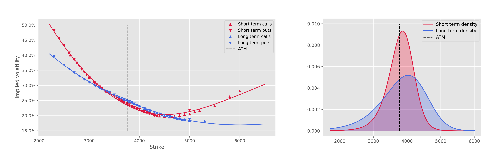

# Martingale optimal transport

This is the implementation of the martingale optimal transport problem where we want to find the minimizing (or maximizing) market measure on the set of martingales for a certain payoff (or cost):

$$\sup_{\mathbb{Q} \in \mathcal{M}(\mathbb{P}^1, \mathbb{P}^2)} \mathbb{E}^{\mathbb{Q}}\left[c(S_{t_1}, S_{t_2})\right],
\tag{P}$$

with $$\mathcal{M}(\mathbb{P}^1, \mathbb{P}^2) \coloneq \{ \mathbb{Q} \in \mathcal{P}(\mathbb{P}^1, \mathbb{P}^2) : \mathbb{E}^{\mathbb{P}}\left[X_{t_2} \mid X_{t_1}\right] = X_{t_1} \}.$$

This is used to derive model-free bounds on exotic options prices.

In particular we focus on a forward start payoff: $(S_{t_2} - K S_{t_1})^{+}$.

To solve this problem, we derive an equivalent dual involving the convex biconjugate function where we need to optimize on the set of integrable function rather than the set of joint martingale measure, which is more convenient:

$$\sup_{\mathbb{Q} \in \mathcal{M}(\mathbb{P}^1, \mathbb{P}^2)} \mathbb{E}^{\mathbb{Q}}\left[c(S_{t_1}, S_{t_2})\right] = \inf_{u\in L^1(\mathbb{P}^2)} \mathbb{E}^{\mathbb{P}^1}\left[(c(S_{t_1}, \cdot) - u(\cdot))^{\ast \ast}(S_{t_1}) \right] + \mathbb{E}^{\mathbb{P}^2}\left[u(S_{t_2}) \right]$$

## Numerical implementation

We derive the market measures $\mathbb{P}^1$ and $\mathbb{P}^2$ by interpolating SPX option prices (with SVI) and deriving them twice with respect to the strikes.

Them we decide to train a neural network to solve the optimization problem: solving for $u = \mathcal{L}(\textbf{W}, \textbf{b})$, where $\textbf{W}, \textbf{b}$ are learnable parameters of a neural network.

